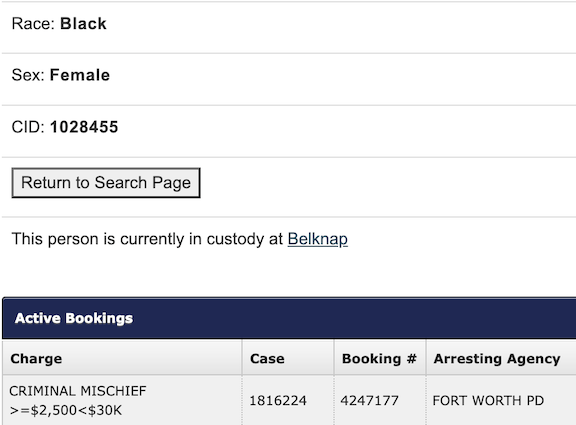

# Tarrant County Jail Bookings/Bonds Scraper

This is part of a project used to track patients' entry into and exit from
Tarrant County Jail (TCJ). It is no longer in use as there is now tighter
integration between TCJ and the hospital's EHR such that entry/exit times
are written to patients' medical records. 
  
The project was setup on Google Cloud Platform:  
* Cloud Storage buckets to hold (raw PDF) daily TCJ [bookings](https://www.tarrantcountytx.gov/en/sheriff/detention-bureau/daily-booked-in-reports.html) and [bonds](https://www.tarrantcountytx.gov/en/sheriff/detention-bureau/daily-bond-reports.html) reports  
* Cloud Functions to download and parse daily TCJ reports and a troll over "in jail" interface  
* Cloud Scheduler to run functions daily
* BigQuery dataset and tables to hold transformed data 

The Selenium (python) browser automation piece that trolled over the
[inmate search](https://inmatesearch.tarrantcounty.com/) interface
adding entries, accumulating days in jail, and denoting exits is not included here as it contains
logic for matching inmates to hospital patients.  
  
A BigQuery table for runs with errors (source, stage, error code, line number) is included though
its primary use was early in the testing phase.  
  
What is included here:  
* the Cloud Functions (e.g., fn-update-charges/)  
* a few notebooks used in development  
* a few screenshots of the GCP project
  
### Example TCJ data (without identifying info):  
#### Booking report

  
#### Bond report
  
  
#### Inmate Search
 
  
### GCP project screenshots
#### Cloud Functions
 
  
#### Cloud Scheduler
 

#### BigQuery
 